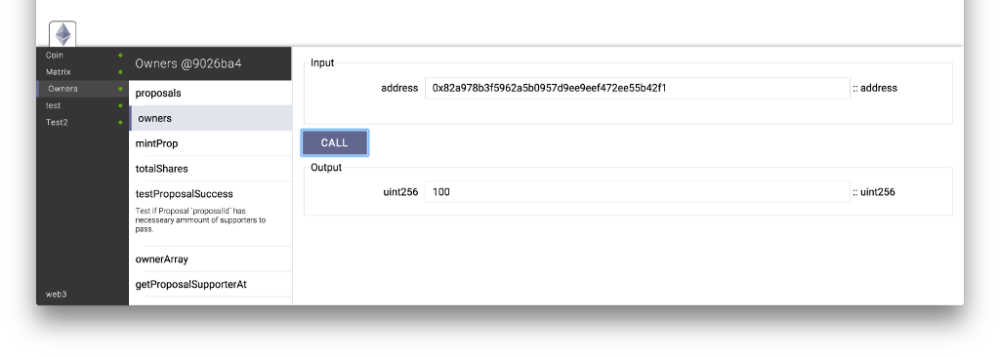

# Contract Inspector
This package allows you to inspect and manipulate the state of your contracts in your browser.

**NOTE:** This Package is under heavy development.



## Installation
Make sure you have the [Solidity Compiler](https://github.com/ethereum/cpp-ethereum) up and running:
```
$ solc --version
solc, the solidity compiler commandline interface
Version: 0.1.0-4a1fcfac/Release-Darwin/clang/int
```

Make sure you have an ethereum rpc client running in the background ( [TestRPC](https://github.com/ConsenSys/eth-testrpc) is recomended )

Install this packages: 
```
meteor add napsy:solidity
meteor add napsy:contract-inspector
```

## Usage
**Use this package only in development.**
[]()

if a contractSetup function is provided, the inspector will be initialized after,
every contract has been set up and a callback is called:

#### Example:
Place the following Contract (`.sol`) anywhere in your project folder:
```
contract Coin {
    address public minter;
    mapping (address => uint) public balances;

    event Send(address from, address to, uint value);

    function Coin() {
        minter = msg.sender;
    }
    function mint(address owner, uint amount) {
        if (msg.sender != minter) return;
        balances[owner] += amount;
    }
    function send(address receiver, uint amount) {
        if (balances[msg.sender] < amount) return;
        balances[msg.sender] -= amount;
        balances[receiver] += amount;
        Send(msg.sender, receiver, amount);
    }
    function queryBalance(address addr) constant returns (uint balance) {
        return balances[addr];
    }
}
```

Initialize the Inspector:

```
Meteor.startup( function() {
  
  ContractInspector.init({
    
    httpProvider: 'http://localhost:8545',
    
    contractSetup: function ( cb ) {
      
      var coin = Contracts.Coin.instance;
      coin.mint( web3.eth.defaultAccount, 42, function() {
        
        coin.send( "0xd858ba0fbd11e2c5491547b072b276458464f30", 12, function () {
          
          var bal = coin.queryBalance( "0xd858ba0fbd11e2c5491547b072b276458464f30" );
          
          console.log( bal ); // should be 12
          
          cb && typeof cb === "function" && cb();
          
        });
        
      });
    }
  });
})
```

## License 

MIT
